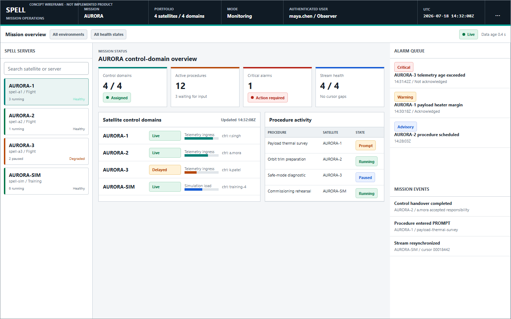
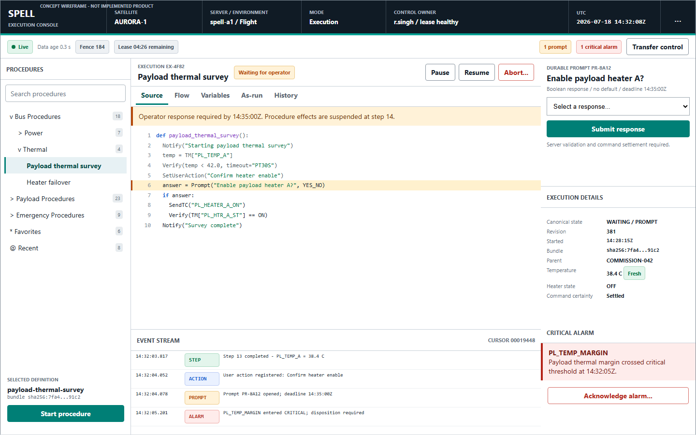
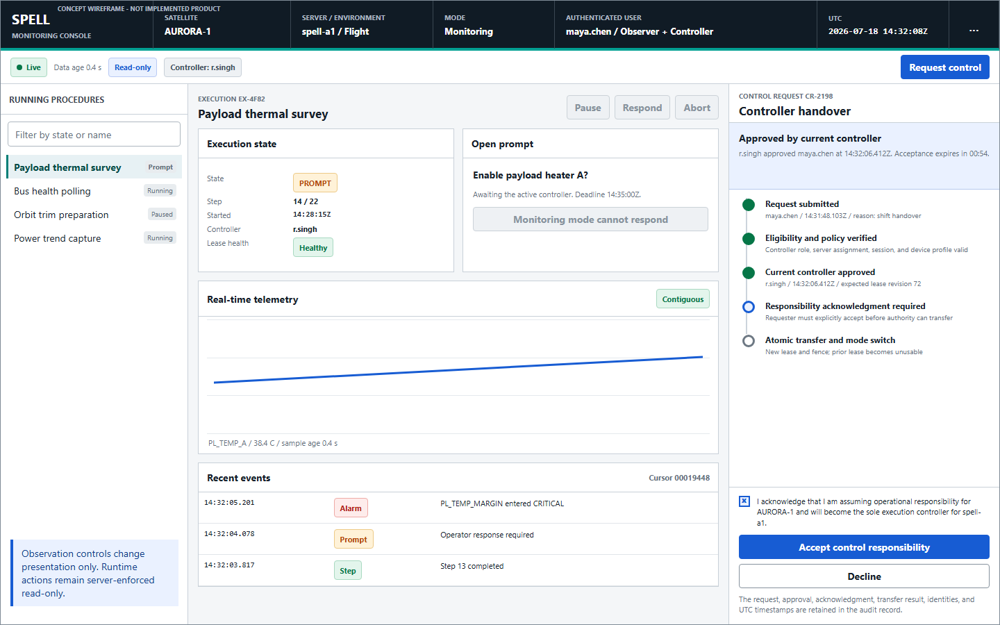
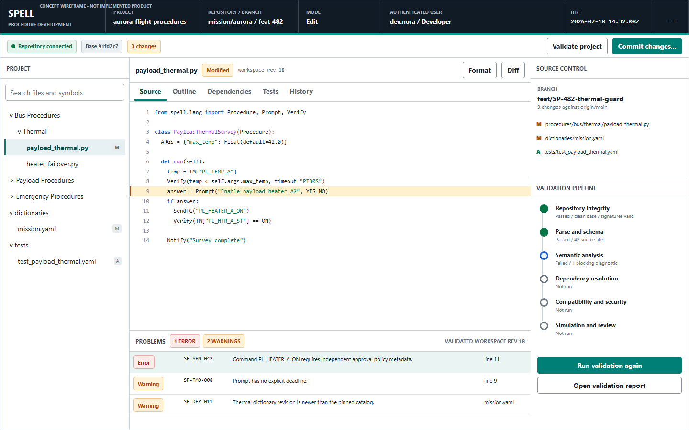

# Next-Generation SPELL Web GUI User Manual

## Document Status

| Field | Value |
| --- | --- |
| Manual version | `0.1.0-draft.1` |
| Specification baseline | Next-Generation SPELL Design Specification `0.1.0-draft.1` |
| Prepared | 2026-07-18 |
| Publication status | Draft concept manual for human review |
| Project-declared AI assistance tool | ChatGPT 5.6 SOL |
| Product build documented | None; interface acceptance build not yet assigned |
| Operational authorization | None |
| Authoritative requirement | `DOC-011` |

This manual describes the intended next-generation SPELL web experience. It is
a user-facing companion to the authoritative design specification, not proof
that the interface has been implemented or accepted. The concept wireframes
show required information relationships and workflow intent; their sample
missions, identities, values, and timestamps are fictional and contain no
operational data.

The central requirements register and detailed design documents remain
authoritative if this manual conflicts with them. In particular, see:

- [Web Application Specification](WEB_APPLICATION.md)
- [Operating Modes and Control Ownership](OPERATING_MODES.md)
- [Procedure Navigation](PROCEDURE_NAVIGATION.md)
- [Real-Time State](REAL_TIME_STATE.md)
- [Procedure Authoring and Git Governance](../procedures/AUTHORING_AND_GIT.md)
- [Security Architecture](../security/SECURITY_ARCHITECTURE.md)
- [Operations and Observability](../operations/OPERATIONS_AND_OBSERVABILITY.md)

## 1. Audience And Scope

This manual is for three primary audiences:

- **Controllers** actively operating procedures for one satellite control
  domain.
- **Monitoring users** observing live or historical state without changing an
  execution.
- **Procedure developers** authoring, validating, reviewing, and promoting
  Git-managed procedure source.

It also supports mission leads, system administrators, security reviewers,
trainers, and support engineers who need to understand the visible authority,
state, alarm, audit, and degraded-operation model.

This manual covers authentication outcome and role-based startup, navigation,
mission dashboards, the procedure tree, Execution Mode, Monitoring Mode, Edit
Mode, controller handover, real-time state, alarms and notifications, execution
and authoring workflows, search and filtering, multi-server operation, user
permissions, and operating practices. Deployment administration, detailed
language semantics, driver development, and production authorization are
covered by their dedicated specifications and authority records.

## 2. Safety And Authority Model

Three concepts are always separate in SPELL:

1. **Role and effective capability** describe what the authenticated principal
   may request in a particular scope.
2. **Selected mode** determines which workspace and controls are presented.
3. **Controller lease** is the server-issued, session-bound, fenced authority
   required for interactive execution changes on one SPELL server.

A Controller role does not by itself provide execution control. Opening an
Execution workspace does not create a lease. Only the one current lease holder
can submit interactive procedure mutations, and the server checks the lease,
session, client proof, revision, fence, authority incarnation, target, and
policy on every request. Hidden or disabled controls simplify the interface;
they are never the security boundary.

The interface never treats local browser state as authoritative. Procedure
state, control ownership, prompts, alarms, telemetry evidence, variables,
command outcomes, and audit facts come from committed server state. When state
is delayed, incomplete, offline, or being resynchronized, the interface says so
and prevents actions that require current authority.

### 2.1 One Satellite Per Server Domain

Each SPELL Satellite Control Domain controls exactly one satellite. It can run
multiple procedures concurrently subject to admission, resource, driver,
conflict, and safety constraints. A mission can operate multiple independent
domains and therefore multiple satellites at the same time.

The selected mission, satellite, server, and environment remain visible in the
global status bar. Before any control action, verify all four. A control lease,
procedure identity, or command from one domain cannot be reused in another.

### 2.2 Command Certainty

Every submitted command receives a durable command identity and progresses to a
server-recorded disposition. A network timeout is not the same as failure. When
the system cannot prove whether an external effect occurred, it shows an
explicit uncertainty state such as `EFFECT_UNKNOWN`; it does not automatically
resend the action.

## 3. Look And Feel

The web application uses a quiet, information-dense mission-control layout.
Position, labels, symbols, and text reinforce color so that state is never
communicated by color alone. Critical information stays in predictable places:

- the dark global bar identifies mission context, identity, mode, control
  owner, UTC time, connection, freshness, and alarm count;
- the left pane provides procedures, folders, server selection, or project
  files;
- the center is the current operational or editing task;
- the right context pane shows prompts, variables, alarms, Git status, or
  selection details;
- the event area shows ordered logs, state changes, command results,
  notifications, and audit-correlated facts.

Panels can be resized or collapsed, but satellite, server, environment, mode,
control owner, connection condition, data age, and critical alarms remain
visible. Desktop layouts show multiple panes together. Tablet layouts open
navigation and context independently. Mobile layouts show one operational pane
at a time and may be restricted to Monitoring or qualified prompt workflows by
deployment policy.

## 4. Authentication And Role-Based Startup

After authentication, the server evaluates identity, session, roles,
attributes, domain and environment scope, device policy, and current policy
revision. It returns effective capabilities and permitted modes. The browser
does not infer permissions from a role label or token field.

### 4.1 Startup Outcomes

The baseline single-role rows below apply only when no approved domain,
environment, device, or incident policy imposes a more restrictive outcome.

| Effective authorization | Initial experience |
| --- | --- |
| Single Controller role; valid lease for this session; no restrictive override | Execution workspace with active controls |
| Single Controller role; no valid lease; no restrictive override | Execution workspace in a visible, non-authorizing `AWAITING_CONTROL` state; acquire an available lease or switch to Monitoring to request handover |
| Single Monitoring role; no restrictive override | Monitoring workspace with read-only operational projections |
| Single Developer role; no restrictive override | Edit workspace for authorized Git projects and repositories |
| Multiple permitted modes | Server-selected safe default or a chooser containing only permitted modes |
| More restrictive policy override | More restrictive permitted workspace, reauthorization, or access denial with governing policy revision and stable reason; never elevated authority |
| No permitted mode | Access-denied view with support correlation; no operational data or controls |
| Reauthentication or policy refresh required | Reauthorization view; sensitive state is cleared according to policy and mutations remain disabled |

The shell displays authenticated identity, effective roles, selected mode, and
controller status as separate fields. This makes it possible to distinguish a
controller-eligible monitor from the actual control holder.

### 4.2 Switching Modes

Users with multiple roles may switch among server-returned permitted modes
without signing out, subject to organizational policy. The mode switch changes
the workspace and its effective capabilities; it does not merge excluded
capabilities from another role, acquire a controller lease, or create Git
authority.

Obtaining execution authority in the Execution workspace follows one of these
server-controlled paths:

- use an active lease already bound to the same authenticated session and
  client instance;
- acquire an available lease through the approved acquisition workflow; or
- complete the controller handover workflow in Section 10.

Moving out of Execution Mode does not silently abandon responsibility. Release,
handover, or policy-directed control disposition is explicit and audited.

### 4.3 Session And Reauthentication Signals

The application warns before a session or control lease expires. Some critical
actions may require recent authentication, a reason, independent approval, or
step-up authentication. Reauthentication never changes the action's target or
replays a pending command automatically. After returning, review server,
satellite, mode, control owner, data age, active prompts, alarms, and command
certainty before proceeding.

## 5. Application Shell And Navigation

### 5.1 Global Status Bar

| Field | What to verify |
| --- | --- |
| Mission | The intended mission or program context |
| Satellite | The exact satellite controlled by the selected domain |
| SPELL server | Stable server/domain identity, not only a display nickname |
| Environment | Flight, test, training, simulation, or other approved boundary |
| Identity and role | The authenticated user and effective role context |
| Mode | Execution, Monitoring, Edit, or Replay |
| Control owner | Current controller identity and lease health, or Available |
| Connection | Live, Delayed, Gap detected, Synchronizing, Offline, or Reauthorization required |
| Data age | Time since the newest authoritative update |
| UTC clock | Server-aligned operational time presentation |
| Alarm count | Active critical alarms requiring attention |

Never rely on a browser tab title or remembered context. Recheck the global bar
after navigation, reconnect, handover, authentication refresh, or server
selection.

### 5.2 Routes, Tabs, And Context

The URL identifies the logical view and stable resource IDs but contains no
access token, credential, prompt response, sensitive value, source fragment, or
driver endpoint. Workspace tabs change the presentation of one selected
resource; they do not change server state unless a clearly labeled command is
submitted.

Common tabs include Source, Flow, Variables, As-run, History, Outline,
Dependencies, Tests, Problems, Diff, and Git history. Replay is visually
distinct from live operation and never exposes operational controls.

### 5.3 Dashboard Overview

The mission dashboard summarizes multiple server domains without merging their
authority. It supports rapid comparison of:

- assignment and health for each satellite control domain;
- current controller and control availability;
- active, paused, waiting, failed, and terminal procedures;
- critical and warning alarms;
- real-time stream health and data age;
- degraded components and capacity signals; and
- recent control, procedure, recovery, and security events.



**Figure 1. Mission dashboard concept.** The dashboard is an observational
portfolio view. Selecting a different satellite changes context explicitly and
never transfers a lease or command authority across domains.

## 6. Procedure Browser And Tree Navigation

The procedure browser organizes authorized procedures in a hierarchy. The
initial category model supports Bus, Payload, Platform, Test, Commissioning,
Maintenance, Emergency, and authorized user-defined categories. Category names
are organizational labels, not security roles.

### 6.1 Tree Behavior

- Expand or collapse nested folders without changing selection.
- Select a definition to open its metadata and available instances.
- Use stable procedure identity rather than assuming a path or display name is
  unique.
- When multiple instances of a definition exist, choose the intended
  `execution_id`; selecting the definition never silently switches instances.
- Favorites and recent items are personal metadata. They do not alter Git
  structure and do not reveal unauthorized procedures.
- Permission-aware results omit procedures the user cannot discover.

### 6.2 Search And Filtering

Search can match authorized folder names, procedure names, stable IDs, tags,
owners, and approved metadata. Filters can narrow by category, state, server,
satellite, environment, criticality, ownership, favorites, recent use, Git
branch, validation status, or other policy-approved facets.

Operational search does not search uncommitted editor buffers. Edit Mode search
is scoped to the current authorized repository/workspace and clearly
distinguishes workspace content from promoted or running bundles. Clearing a
filter restores the authorized result set; it never broadens authorization.

### 6.3 Procedure Details

Before start or edit, inspect the stable procedure ID, display name, project,
version, immutable bundle digest or workspace revision, language profile,
required arguments, dependencies, declared resources, driver capabilities,
validation status, promotion environment, and operational notes. A running
instance always identifies the exact immutable bundle used for that execution.

## 7. Execution Mode

Execution Mode is the active-controller workspace. It combines live procedure
state, source position, prompts, variables, events, logs, alarms, and command
settlement while keeping the selected satellite and control authority visible.



**Figure 2. Execution workspace concept.** The active prompt and critical alarm
remain latched; the current source comes from the running immutable bundle, not
an editor buffer.

### 7.1 Available Actions

Depending on procedure state, policy, capabilities, and the active lease,
Execution Mode can present:

- start, stop, pause, resume, step, skip, goto, reload, abort, and recover;
- prompt response and structured operator input;
- schedule creation or management;
- procedure instance selection and concurrent-execution management;
- alarm acknowledgment or policy-controlled suppression;
- lease renewal, release, and controller handover; and
- command reconciliation when an outcome is uncertain.

An action appears only when relevant to the effective capability and selected
mode. A temporarily invalid action can be disabled with a specific explanation,
such as no lease, stale data, wrong procedure state, missing approval, or an
outdated expected revision. The server makes the final decision.

### 7.2 Starting A Procedure

1. Confirm mission, satellite, server, environment, mode, control owner,
   connection, and data age.
2. Select the procedure definition and inspect its stable identity, promoted
   version, bundle digest, validation status, declared effects, dependencies,
   and required capabilities.
3. Review active instances and concurrency constraints so the new instance does
   not conflict with another procedure or exclusive resource.
4. Enter arguments using their displayed types, ranges, units, defaults, and
   validation rules. Sensitive values remain redacted according to policy.
5. Review the start summary, including target satellite, immutable source,
   arguments, resource admission, schedule, reason, and required approval.
6. Submit once. The interface prevents accidental duplicates while the request
   is in flight and preserves the original idempotency key on retry.
7. Wait for a durable accepted or rejected command result. Do not interpret a
   browser timeout as a failed start.
8. Confirm the new `execution_id`, canonical state, revision, pinned bundle, and
   first committed event before continuing.

### 7.3 Pausing, Resuming, Stopping, And Aborting

Pause and resume are state-machine operations, not local display controls.
Stopping, aborting, skipping, goto, reload, recovery, and forced transitions can
have different operational consequences. The confirmation identifies the
satellite, execution, current state, requested transition, and consequence.
Generic confirmation text is not sufficient for critical actions.

For a critical command:

1. Read the consequence-specific confirmation.
2. Verify the execution and source position.
3. Review dependent procedures, active driver operations, prompts, and
   uncertain effects.
4. Enter the required reason and complete any step-up or independent approval.
5. Submit once and follow the command resource through final settlement.
6. If certainty is unknown, use the approved reconciliation workflow; do not
   repeat the action speculatively.

### 7.4 Concurrent Procedures

One server can execute multiple procedures for its satellite. Each instance has
its own `execution_id`, state, revision, source position, variables, prompts,
logs, resources, and pinned bundle. The instance selector prevents two runs of
the same definition from being confused.

Admission control can start, queue, or reject a procedure based on resource,
driver, capacity, dependency, serialization, or safety rules. A queued start is
not a running execution. Review the reason and current constraints rather than
repeatedly resubmitting it.

### 7.5 Prompts And Operator Inputs

A durable prompt shows:

- procedure and execution identity;
- immutable source location and current step;
- prompt type and allowed response;
- units, ranges, validation, and permitted options;
- default and precedence policy, if any;
- opening time, deadline, and response state; and
- scope, controller identity, command ID, and final settlement.

Enter the response only after confirming its target. Client-side validation
provides immediate feedback, but the server repeats validation and determines
the winning response. A prompt race, stale revision, expired lease, or response
from Monitoring Mode is rejected without changing the procedure.

Operator inputs that are not prompt responses use the same durable command
pattern. Free text is treated as untrusted data, never executable markup.

### 7.6 Variables, Telemetry, And Source

Compound values can be expanded to show type, scope, revision, update time, and
provenance. The interface distinguishes redacted, null, empty, unavailable, and
stale values. Telemetry displays sample time, ingestion time, age, quality, and
source so an operator can determine whether it is suitable for a decision.

The source view uses the immutable bundle digest, document identity, and parsed
source span for the running instance. Current, completed, waiting, selected,
and error lines are visually and programmatically distinct. Editing a procedure
does not change this view or the running execution.

### 7.7 Command Settlement And Uncertainty

The command panel records target, parameters, submitting identity, UTC time,
command ID, expected revision, approval evidence, progress, and terminal
outcome. Typical presentation states include accepted, in progress, settled,
rejected, superseded, canceled, and effect uncertain.

When `EFFECT_POSSIBLE` or `EFFECT_UNKNOWN` is shown:

- preserve the command and correlation ID;
- inspect external acknowledgment and telemetry evidence;
- follow the approved reconciliation or recovery procedure;
- keep dependent effects suspended when policy requires it; and
- never create a second attempt until the system authorizes a disposition.

## 8. Monitoring Mode

Monitoring Mode provides read-only access to authorized live and historical
projections. It can show running procedures, execution state, telemetry,
events, variables, logs, alarms, control ownership, and system health at the
same observational fidelity allowed to the controller.

Runtime and procedure mutations are absent or disabled. Direct API calls,
modified browser markup, stale enabled states, and prompt races are also denied
by the server. The only permitted writes from this workspace are eligible
submission, withdrawal, or decline of a non-authorizing control request.

### 8.1 Monitoring Workflow

1. Select the intended satellite control domain.
2. Confirm Live or review the displayed degraded state and data age.
3. Select a running procedure by stable execution identity.
4. Inspect state, current source, variables, telemetry, prompts, logs, events,
   alarms, and command outcomes.
5. Use filters and layouts to manage high-rate information without suppressing
   required critical facts.
6. When control is operationally required and the user is controller-eligible,
   start the Request Control workflow; otherwise contact the responsible
   controller through the approved mission communication path.

The product imposes no fixed count of monitoring users. Each deployment still
has a measured and published capacity ceiling, reconnect policy, and overload
behavior. Monitoring traffic cannot consume the capacity reserved for control
commands and critical alarms.

### 8.2 Monitoring Restrictions

Monitoring users cannot start, stop, pause, resume, abort, skip, goto, reload,
recover, schedule, answer prompts, provide runtime inputs, acknowledge
operational alarms, or otherwise change procedures unless a separate policy
explicitly grants a non-runtime function. A Request Control submission does not
grant authority and does not modify a running procedure.

## 9. User Roles And Permissions

Deployments map organizational identities and attributes to granular
capabilities; role names are convenient groupings, not the authorization
algorithm. The baseline user experience is:

| Role context | Typical permitted mode | Typical capabilities | Explicitly not implied |
| --- | --- | --- | --- |
| Controller | Execution and Monitoring | Acquire or hold control; manage procedures; answer prompts; provide inputs; transfer control | Git edit, review, promotion, security administration |
| Observer or Monitoring | Monitoring | Read authorized live/history state; filter, inspect, export when policy permits; request control only when separately controller-eligible | Runtime mutation, prompt response, alarm disposition |
| Developer | Edit | Create, modify, move, rename, delete, refactor, validate, analyze, test, diff, commit, and request review within authorized repositories | Runtime control, direct promotion, driver access |
| Reviewer or approver | Edit or review workspace | Review changes, diagnostics, evidence, and policy gates assigned to the role | Authoring, merge, promotion, or control unless separately granted |
| Administrator or security role | Dedicated administrative scope | Identity, policy, audit, configuration, or security functions assigned by policy | Automatic Controller or Developer authority |

Capabilities are also scoped to mission, satellite/domain, environment,
repository, branch, procedure class, action, effect class, and time. The UI
hides permanently unavailable features and explains temporary restrictions.
Audit records capture startup policy and mode decisions, including denied
requests.

## 10. Secure Controller Handover

Normal controller handover is a two-person, two-decision workflow. The current
controller approves a named request first. The requester then explicitly
acknowledges responsibility. Only after both durable decisions remain current
does the server atomically replace authority.



**Figure 3. Monitoring and controller-handover concept.** Approval does not
transfer control. The named requester must acknowledge the exact operational
context before the server can create the new lease and higher fence.

### 10.1 Requesting Control

The **Request control** action appears only for a controller-eligible principal
in Monitoring Mode when policy permits the workflow.

1. Verify server, satellite, environment, current controller, connection, and
   data age.
2. Review active and suspended procedures, prompts, alarms, commands, schedules,
   and unresolved or uncertain effects.
3. Enter the operational reason and submit one named request.
4. The server checks requester capability, session and client proof, scope,
   policy, expected lease revision, deadline, and existing request state.
5. The request receives a durable ID and notifies the current controller. It
   remains non-authorizing; all execution controls stay disabled.

The requester may withdraw an eligible pending request. Expiry, revocation,
policy change, loss of eligibility, or a changed lease can invalidate it.

### 10.2 Current Controller Decision

The current controller receives the requester's identity, effective role,
request reason, request time, deadline, target server/satellite, and current
operational context.

Before approving:

1. Verify the named requester and mission communication.
2. Review active executions, prompts, alarms, command settlement, uncertain
   effects, and any responsibility that cannot be transferred safely.
3. Stabilize or explicitly preserve unresolved work as policy requires.
4. Approve or decline the exact request. A holder decline records the canonical
   `CANCELLED` outcome with the holder identity, trusted time, and reason; it
   does not create a separate `DENIED` state. Approval is bound to that request,
   requester session/client key, lease revision, context digest, and deadline.

While the request is only `REQUESTED`, the current holder remains responsible
and effect-capable and the requester has no control. Approval changes the lease
to `HANDOVER_PENDING` but does not give the requester control. From that
approval until cancellation, requester decline, expiry, or atomic transfer, the
server blocks every new external effect for both parties.

### 10.3 Requester Responsibility Acknowledgment

After approval, the requester receives a responsibility statement naming the
server, satellite, active executions, prompts, alarms, commands, uncertain
effects, current controller, and approval. The requester reviews that current
context and explicitly acknowledges that they are assuming operational
responsibility.

The acknowledgment cannot be completed before the current controller's
approval, cannot be prechecked by policy, cannot be supplied by another user or
session, and cannot be replayed for another request. A requester decline records
the canonical `DECLINED` outcome with requester identity, trusted time, and
reason; clears the active request after audit persistence; returns the existing
holder lease to `ACTIVE` only when that lease remains current, unexpired, and
authorized; and leaves the requester in Monitoring Mode. Otherwise the winning
expiry, revocation, or replacement state remains authoritative. A decline does
not create a `ResponsibilityAcknowledgementId`.

### 10.4 Atomic Transfer And Automatic Mode Change

On accepted acknowledgment, one server transaction:

- records the request-bound responsibility acknowledgment;
- terminalizes the former grant as transferred;
- creates and installs exactly one new active lease for the requester session
  and client proof;
- increments the control fencing token;
- records the authoritative mode projections, local audit, and outbox rows.

After the transaction commits, the outbox relay publishes the new authority
and mode changes. Publication is not part of the database transaction.

The requester automatically enters Execution Mode only after receiving the
authoritative committed transfer event and contiguous current state. The former
holder moves to Monitoring Mode or another permitted non-control mode. Delayed
former-holder requests fail the old lease and fence checks even if that browser
has not yet repainted.

At no point can both users hold valid execution authority for the same server.
Controls remain disabled during a cursor gap, resynchronization, stale context,
or uncertain transfer outcome.

### 10.5 Handover Failure And Recovery

| Condition | User-visible result | Required response |
| --- | --- | --- |
| Current controller declines or cancels | Request records canonical `CANCELLED` outcome with holder reason; no transfer | Requester remains Monitoring; use mission communication if needed |
| Request or approval expires | Expired status; no transfer; the existing lease remains/returns active only while still unexpired and authorized | Reassess current context and create a new request only after confirming current authority |
| Requester loses eligibility or session | Request invalidated; no transfer | Reauthenticate or contact support; do not reuse the request |
| Lease revision or controller changes | Stale request or approval rejected | Refresh current authority and begin a new request if still needed |
| Requester declines responsibility | Canonical `DECLINED` outcome when the request and lease remain current; active request clears; no transfer or acknowledgment ID | Existing holder lease returns to `ACTIVE` only while unexpired and authorized; otherwise the winning expiry/revocation/replacement state applies; requester remains Monitoring |
| Network loss before final result | Transfer outcome shown as pending or uncertain until resynchronized | Do not assume control; recover snapshot/cursor and use authoritative owner/fence state |
| Former holder sends delayed command | Server rejects stale lease/fence | Review rejection and new controller state; do not retry under old authority |

Forced takeover is a separate break-glass workflow with distinct eligibility,
step-up authentication, reason, safety policy, and audit. It is not a shortcut
around the normal approval and responsibility-acknowledgment process.

### 10.6 Handover Audit Record

The append-only audit chain includes each source event's trusted event time and
a separate independent-sink receipt with ingestion time bound to the source
event ID/digest; server, domain, satellite, environment, and policy revision;
event-applicable current-holder and requester identities, roles, sessions, and
client keys; request, approval, and acknowledgment identities; reasons and
outcomes; prior and new lease IDs, revisions, and fences; context digests;
correlation ID; rejections, expiry, withdrawal, or decline; and the authoritative
mode changes. Secret response content is represented by an approved safe digest
or reference rather than being copied into logs.

## 11. Edit Mode

Edit Mode is a separate procedure-development workspace. It manages editable
source through Git and non-executing language services. It never edits the
immutable source bundle of a loaded or running execution and has no route to an
operational driver or Ground Control System.



**Figure 4. Edit workspace concept.** The workspace revision, base commit,
branch, diagnostics, and pipeline stage are visible. A validation failure blocks
promotion; it does not change a running procedure.

### 11.1 Edit Workspace Areas

| Area | Purpose |
| --- | --- |
| Project tree | Authorized repositories, nested folders, procedures, libraries, dictionaries, catalogs, tests, and documentation |
| Source editor | Syntax highlighting, folding, source spans, outline, symbol navigation, completion, and deterministic formatting |
| Problems view | Stable diagnostic code, severity, source span, message, language profile, remediation, and tool version |
| Dependency view | Calls, libraries, dictionaries, catalogs, cycles, versions, missing and unused dependencies, and impact |
| Source control | Repository, branch, base commit, workspace revision, modified files, diff, history, and review status |
| Validation pipeline | Integrity, parse/schema, semantics, dependencies, compatibility, security, simulation, operations review, and reproducibility |

### 11.2 Creating Or Modifying A Procedure

1. Open the authorized project and verify repository, branch, base commit, and
   workspace revision.
2. Create a branch from an approved ref or resume the intended server-managed
   workspace.
3. Create, modify, move, rename, refactor, or delete procedures and folders
   using stable procedure IDs. A rename or move does not create a new identity.
4. Update typed metadata, dictionaries, tests, dependencies, and operational
   notes with the source change.
5. Save against the expected workspace revision. A concurrent change returns a
   structured conflict instead of overwriting another user's work.
6. Run file, folder, changed-set, and project validation as appropriate.
7. Resolve Problems by stable diagnostic code and source span. Do not hide a
   warning by changing its client-side severity.
8. Review source, metadata, dependency, and validation-result diffs.
9. Stage intentional files, enter a descriptive commit message and change
   identity, and use the approved signing flow.
10. Push through the authoring service and open or update a review request.

The browser never receives a long-lived Git remote credential. Parsing,
completion, formatting, indexing, analysis, and validation do not execute
procedure source, import arbitrary code, contact a driver, or fetch unapproved
network resources.

### 11.3 Validation Pipeline

| Gate | Developer check |
| --- | --- |
| Repository integrity | Exact clean base, stable IDs, permitted files, signatures, manifest, and secret scan |
| Parse and schema | Procedure source, metadata, dictionaries, catalogs, and tests parse against pinned schemas |
| Semantic analysis | Types, scopes, arguments, control flow, calls, modifiers, steps, resources, and effect rules validate |
| Dependency resolution | Complete acyclic allowlisted graph with pinned identities and digests |
| Compatibility | Every used legacy construct has an approved disposition and conformance evidence |
| Security | Static, secret, dependency, provenance, and policy checks pass |
| Simulation | Deterministic scenarios cover success, failure, prompts, restart, abort, and expected traces |
| Operational review | Owners accept arguments, effects, alarms, timeouts, recovery, and operator text |
| Bundle reproducibility | Independent build yields the same content digest |

A warning requires the policy-defined disposition. A failed gate cannot be
bypassed by editing browser state.

### 11.4 Review, Promotion, And Rollback

Protected branches require validation, code-owner review, approved signatures,
and no unresolved blocking finding. The builder consumes an exact approved Git
commit in a pinned environment and produces an immutable, content-addressed
bundle with source, dependency, catalog, toolchain, test, approval, and
provenance identities.

Promotion maps an environment/catalog entry to an already verified bundle; it
does not rebuild or edit the artifact. Rollback promotes a previously approved
digest as a new audited decision. Promotion, withdrawal, supersession, and
rollback never mutate a running execution implicitly.

Developers cannot use Edit Mode to grant their own runtime role, change audit
history, modify validation evidence, place a bundle directly in artifact
storage, or promote without the authorized service and approvals.

## 12. Real-Time Monitoring And Freshness

The client starts with an authoritative snapshot and cursor, then applies
ordered committed events. Event delivery is a projection of committed state,
not a separate source of truth. If an event is missing, the client stops
mutation, declares the gap, and resynchronizes rather than guessing.

### 12.1 Connection Conditions

| Condition | Meaning | Interaction |
| --- | --- | --- |
| Synchronizing | Snapshot or gap recovery is in progress | Mutations disabled until a contiguous current projection is established |
| Live | Cursor is contiguous and data age is within policy | Mode-authorized actions available |
| Delayed | Stream is contiguous but older than warning policy | Warning remains visible; mutation depends on server policy |
| Gap detected | One or more committed events are missing | Mutations disabled; automatic snapshot/cursor recovery |
| Offline | No authenticated control-plane connection | Cached state marked stale; all mutations disabled |
| Reauthorization required | Session or stream authority is invalid | Sensitive content cleared by policy; mutations disabled |

Connection text, symbol, data age, latest authoritative update, and cursor or
revision context stay visible. A green network indicator alone is not enough to
establish freshness.

### 12.2 Real-Time Data Types

The interface synchronizes procedure execution status, source position, logs,
events, variables, telemetry, command acknowledgments, alarms, prompts,
operator notifications, control ownership, health, and recovery state. Each
projection exposes the identity and ordering information needed to detect stale
or incomplete data.

High-rate telemetry may be coalesced for display under an approved policy, but
committed transitions, command outcomes, alarms, prompts, and authority changes
are not silently dropped. Historical and replay views are labeled and cannot be
mistaken for live control state.

### 12.3 Reconnect Procedure

1. Observe the connection condition and stop making assumptions based on the
   last visible state.
2. Allow snapshot and cursor recovery to complete.
3. Review any stated gap, stream-epoch reset, authorization scope change, or
   sensitive-data clearing.
4. Confirm server, satellite, mode, control owner, lease health, data age,
   procedures, prompts, alarms, and unsettled commands.
5. Resume operational interaction only after the interface reports a contiguous
   current projection and the server enables the action.

The browser does not queue state-changing commands for later delivery while
offline.

## 13. Alarms, Events, Logs, And Notifications

### 13.1 Alarm Presentation

An alarm shows stable identity, severity, state, source, satellite/domain,
related procedure or telemetry, first and latest occurrence, acknowledgment,
suppression or shelving state when permitted, and required disposition. Alarm
severity and state use text and symbols in addition to color.

Critical alarms, control loss, stale state, uncertain effects, rejected prompt
responses, and recovery-required conditions remain latched until the server
records an authorized terminal disposition. A transient toast is not the only
presentation for a condition requiring action.

### 13.2 Acknowledging An Alarm

1. Verify the alarm identity, satellite, source, severity, age, and related
   execution.
2. Review telemetry quality, active procedures, prompts, and command certainty.
3. Follow the mission response procedure and communication protocol.
4. When authorized, acknowledge the exact alarm and provide the required reason
   or comment.
5. Confirm the durable result and audit correlation. Acknowledgment records
   awareness; it does not necessarily clear the underlying condition.

Suppression, shelving, reset, and clearance are separate policy-controlled
actions and can require stronger approval.

### 13.3 Events And Logs

Events present authoritative state changes in committed order. Logs provide
diagnostic and procedural detail. The interface keeps as-run, command, support,
security, and audit projections distinguishable even when they share one event
area. Search and filters change presentation only; hidden rows remain part of
the retained record.

Every line that can affect an operational interpretation exposes timestamp,
source, severity or kind, domain/execution identity, and correlation where
available. Sensitive values are server-redacted before delivery.

### 13.4 Operator Notifications

Notifications can announce procedure milestones, handover requests, prompts,
upcoming lease/session expiry, scheduled operations, recovery actions, or
support information. Informational notifications can be dismissed according to
policy. Dismissal never resolves a critical alarm, prompt, control-loss state,
or command uncertainty.

## 14. Procedure Execution Workflow

This end-to-end sequence is the baseline controller workflow.

### 14.1 Before Execution

- Authenticate through the approved identity provider and verify the returned
  role/mode context.
- Confirm the intended mission, satellite, server, and environment.
- Establish Live, contiguous current state and inspect data age.
- Confirm the one current controller and lease health.
- Review active procedures, prompts, alarms, schedules, driver/system health,
  and unresolved command effects.
- Select the exact promoted procedure bundle and validate its operational
  approval, version, arguments, dependencies, and effects.
- Check concurrency and exclusive-resource admission.

### 14.2 During Execution

- Track canonical state and revision rather than inferring state from logs.
- Follow current source from the immutable as-run bundle.
- Respond to prompts only after verifying execution, deadline, type, and target.
- Treat critical actions as command resources with durable outcomes.
- Maintain awareness of child procedures, shared resources, schedules, and
  parallel instances.
- Keep critical alarms, stale-state warnings, and uncertain effects visible
  until disposition.
- Use controlled handover when operational responsibility changes.

### 14.3 After Execution

- Verify the terminal procedure state and settlement of all commands/prompts.
- Review the as-run event sequence, source digest, arguments, variables,
  telemetry evidence, alarms, operator actions, and child outcomes.
- Record required shift, anomaly, or mission notes through approved channels.
- Release or hand over control explicitly when responsibility ends.
- Retain or export reports only when authorized and with server-provided
  provenance and classification labels.

## 15. Procedure Editing Workflow

The end-to-end developer workflow is:

1. Confirm repository, project, branch, base commit, language profile, and
   workspace revision.
2. Create a controlled branch and make scoped source, metadata, dictionary,
   catalog, test, and documentation changes.
3. Run non-executing syntax and semantic services.
4. Review dependency and compatibility impact, including every legacy construct
   used by the changed procedure.
5. Run deterministic simulation and expected-trace tests.
6. Inspect Problems, security and secret findings, source/metadata diffs, and
   validation deltas.
7. Commit with a change identity and approved signature.
8. Push through the authoring service and obtain required code-owner,
   independent, mission, language, security, and operations reviews.
9. Build and independently reproduce an immutable bundle.
10. Promote the approved digest through the server-side registry for the
    intended environment.
11. Confirm catalog activation without changing running or scheduled instances
    implicitly.
12. Retain source, artifact, approval, validation, and rollback evidence.

Deletion removes or changes editable source through reviewed Git history; it
does not erase retained as-run bundles, execution evidence, or audit records.

## 16. Multi-Server And Multi-Satellite Operation

A mission dashboard can observe many independent satellite control domains.
Each row retains its own satellite, server, environment, controller, health,
data age, alarm count, stream cursor, capacity, and active procedures. Cross-
domain orchestration calls each domain's authorized public contract; it does
not reuse a controller token or write another domain's state.

### 16.1 Switching Domains

1. Use the server/satellite selector and read the explicit target change.
2. Verify environment and connection freshness in the new context.
3. Confirm the new control owner and whether the current user has only
   Monitoring access, is controller-eligible, or holds the active lease.
4. Re-select the procedure or execution; stable IDs remain domain scoped.
5. Do not transfer arguments, prompt responses, command IDs, leases, or
   assumptions from the previous satellite.

Opening several browser tabs does not create several controllers. A lease is
bound to one session and one tab-local proof key. Other tabs can monitor and,
when eligible, submit a handover request; they cannot reuse the controller
tab's authority.

### 16.2 Fleet-Level Degraded Operation

A failure in one domain is displayed without converting healthy domains to the
same state. Central dashboard or real-time gateway degradation does not imply
that procedure execution stopped. Conversely, a healthy dashboard connection
does not prove a driver, database, domain writer, or satellite link is healthy.
Inspect each named component and its authoritative timestamp.

## 17. Best Practices For Controllers

- Keep the global context and control-owner fields visible; recheck them after
  every reconnect, handover, server switch, or reauthentication.
- Prefer stable IDs and immutable digests over display names when identifying a
  procedure, execution, command, bundle, or alarm.
- Treat Live as a freshness condition, not merely a network connection.
- Read consequence-specific confirmations and never approve a generic-looking
  critical action from memory.
- Submit each command once and follow its durable status. Reconcile uncertainty
  instead of retrying an external effect.
- Read prompt type, deadline, source, scope, default, and target before
  responding.
- Do not dismiss or visually filter the only presentation of a critical alarm,
  control loss, stale state, or uncertain effect.
- Keep mission voice or approved communications synchronized with controller
  handover. The application audit complements, but does not replace, mission
  communications.
- Transfer control through the named request, holder approval, and requester
  acknowledgment workflow. Never share credentials or browser sessions.
- Use Replay for investigation and training; verify its prominent non-live
  label before interpreting state.
- Stop and use the approved runbook when UI state, mission communication, and
  authoritative server state disagree.

## 18. Best Practices For Monitoring Users

- Verify satellite, server, environment, connection, and data age before
  reporting an observation.
- Distinguish a displayed procedure definition from a specific running
  `execution_id`.
- Preserve exact alarm, event, cursor, command, and correlation IDs when
  escalating.
- Use filters to reduce visual load but clear them when investigating missing
  information.
- Do not treat disabled controls as proof that the server would accept or deny
  an action; server audit is authoritative.
- Request control only when operational responsibility can be assumed and the
  current context has been reviewed.
- After current-controller approval, reread active procedures, prompts, alarms,
  and uncertain effects before acknowledging responsibility.
- Do not act until the committed transfer identifies the user as the new holder
  and current state is contiguous.

## 19. Best Practices For Procedure Developers

- Work from an authorized branch and verify the base commit before editing.
- Preserve stable procedure IDs through rename and move operations.
- Keep procedure source, dictionaries, catalogs, tests, and operational notes in
  the same reviewed change when behavior changes.
- Resolve conflicts explicitly; never rely on a stale presence indicator or
  advisory lock.
- Treat every diagnostic as bound to an exact tool version, workspace revision,
  language profile, and source span.
- Run dependency and compatibility analysis before review, not only after a
  build fails.
- Never place secrets, credentials, runtime checkpoints, as-run logs,
  uncontrolled binaries, or generated bundles in the procedure repository.
- Review generated snippets as source; templates do not confer correctness or
  approval.
- Require deterministic simulation and reproducible bundles for protected
  promotion.
- Use rollback by promoting an approved historical digest; do not rewrite
  history or replace artifact bytes.
- Verify that operational documentation and prompts remain clear at mission
  tempo and in degraded states.

## 20. Degraded Operation And Troubleshooting

The interface presents a stable reason code, affected capability, first
observation, latest authoritative update, and operator action for degraded
conditions. A warning banner describes state; server-side admission enforces
the restriction.

### 20.1 Common Conditions

| Observation | Likely condition | User response |
| --- | --- | --- |
| Controls disabled while data appears current | No lease, wrong mode, stale expected revision, missing approval, policy restriction, or reauthentication requirement | Read the disabled reason; verify role/mode/lease and refresh authoritative context |
| Synchronizing or Gap detected | Snapshot/cursor recovery | Wait for contiguous recovery; do not submit mutations |
| Delayed data age | Stream or upstream latency | Assess policy and mission impact; treat data as delayed and keep warning visible |
| Offline with cached state | Control-plane connection unavailable | Treat all values as stale; use approved communication and recovery procedures |
| Command remains uncertain | External effect could not be proven | Preserve command ID and reconcile; do not auto-resend |
| Prompt response rejected | Stale prompt, expired deadline, lost lease, winning response, validation, or revision race | Read structured rejection and current prompt state; do not duplicate blindly |
| Start queued or rejected | Capacity, conflict, dependency, resource, driver, or safety admission | Review the named constraint; do not flood retries |
| Handover cannot complete | Request/approval expired, context changed, requester invalid, lease changed, or gap exists | Remain Monitoring, recover current state, and initiate a new request if still appropriate |
| Edit save conflict | Workspace revision or base changed | Compare structured conflict and merge intentionally |
| Validation result differs | Inputs, tool version, catalogs, dependencies, or workspace revision differ | Compare pinned identities; rerun from exact inputs |

### 20.2 Identity Provider Unavailable

Existing unexpired sessions may continue only when approved cached
authorization policy permits it. New login, role escalation, and uncontrolled
break-glass access remain unavailable. If reauthorization is required, the UI
clears sensitive state according to policy and disables mutations.

### 20.3 Real-Time Gateway Unavailable

Authoritative server execution may continue when controller interaction is not
required. The browser cannot infer procedure failure from missing updates.
Recover through the approved snapshot/cursor path and inspect procedures,
prompts, alarms, and commands before resuming interaction.

### 20.4 Authority Or Audit Unavailable

If PostgreSQL authority is unavailable, mutation pauses; cached views can remain
only when explicitly stale. If durable audit handoff for a designated critical
action is unavailable, the action fails closed or enters only a preapproved,
protected emergency mode. Never continue silently without an accountable
record.

### 20.5 Obtaining Support

Provide the support team with non-sensitive identifiers: UTC time, mission,
server/domain, satellite, environment, user/session correlation where policy
allows it, selected mode, connection condition, data age, procedure/execution,
command or request ID, alarm/event ID, error code, cursor/revision, and the steps
that led to the issue. Do not transmit access tokens, credentials, CUI,
unredacted sensitive values, or proprietary source through an unapproved
channel.

## 21. Accessibility And Human Factors

The target interface supports WCAG 2.2 Level AA and mission-specific human-
factors validation. Critical workflows remain keyboard operable with visible
focus, logical order, semantic landmarks, labeled controls, accessible tables
and dialogs, and prioritized live-region announcements.

State, severity, ownership, freshness, and selection do not rely on color alone.
Text and non-text contrast, zoom to 200 percent, reflow, reduced motion, target
size, time-limited prompts, and screen-reader behavior are qualified across the
supported browser and viewport matrix. User preferences cannot suppress
required alarms or audit facts.

Responsive adaptation never changes command meaning or removes critical
context. If a device is not qualified for Execution Mode, the server policy
explains the restriction before control acquisition.

## 22. Search, Filtering, Favorites, And Recents

Search and filters are permission-aware in every workspace. The result count
describes the authorized projection, not the number of hidden resources in the
system. This prevents unauthorized names, counts, or timing patterns from being
revealed.

### 22.1 Operational Views

Useful filters include server, satellite, environment, execution state,
procedure category, severity, time range, source, command certainty, prompt
state, control event, and correlation. Saved views store presentation choices,
not authority or operational state.

### 22.2 Edit Views

Developer search can include files, folders, stable procedure IDs, symbols,
diagnostics, dependencies, tests, history, authors, commits, and review state in
the authorized repository/workspace. A result identifies whether it comes from
the current working revision, base commit, promoted bundle, or history.

### 22.3 Personal Metadata

Favorites and recent procedures are per-principal metadata. They do not move a
repository file, promote a bundle, reveal an unauthorized procedure, or change
another user's navigation. Clearing personal history does not erase operational
or Git audit records.

## 23. Replay And Historical Review

Replay reconstructs an execution from persisted state and events without
contacting a driver. It identifies the original execution, source bundle,
configuration, event range, and replay cursor. Replay is prominently labeled,
uses visually distinct controls, and disables every operational command.

Use replay to investigate an anomaly, review an as-run procedure, train users,
or validate documentation. Moving the replay cursor changes only the historical
presentation. It never changes server state, answers a prompt, acknowledges an
alarm, or acquires control.

## 24. Quick Workflow Checklists

### 24.1 Controller Shift Start

- [ ] Authenticate and verify identity, roles, and selected mode.
- [ ] Verify mission, satellite, server, and environment.
- [ ] Confirm connection condition, data age, and UTC clock.
- [ ] Confirm control owner, lease health, and fencing context.
- [ ] Review active/paused/waiting procedures and schedules.
- [ ] Review prompts, critical alarms, unsettled commands, and uncertain effects.
- [ ] Confirm driver, database, stream, audit, and system health.
- [ ] Complete approved voice/log handover and record the shift start.

### 24.2 Handover

- [ ] Requester is controller-eligible and currently Monitoring.
- [ ] Request names the exact server/satellite and contains the reason.
- [ ] Current controller verifies requester and operational context.
- [ ] Current controller approves the exact current request.
- [ ] Requester reviews procedures, prompts, alarms, commands, and uncertainty.
- [ ] Requester explicitly acknowledges operational responsibility.
- [ ] Committed transfer names the requester as sole active holder with a higher fence.
- [ ] New holder enters Execution; former holder enters a non-control mode.
- [ ] Both users verify the audit-correlated result and mission communication.

### 24.3 Procedure Start

- [ ] Exact promoted procedure ID, version, and digest selected.
- [ ] Arguments, defaults, units, dependencies, effects, and approvals reviewed.
- [ ] Concurrency and resource admission accepted.
- [ ] Target execution and consequence confirmed.
- [ ] One command submitted and durable result observed.
- [ ] New execution ID, bundle, state, revision, and first event verified.

### 24.4 Developer Review

- [ ] Repository, branch, base, workspace revision, and language profile verified.
- [ ] Source, metadata, dictionaries, dependencies, tests, and docs updated.
- [ ] Parse, semantic, compatibility, dependency, security, and simulation checks complete.
- [ ] Problems and diff reviewed with no hidden blocking finding.
- [ ] Commit/change identity and signature valid.
- [ ] Required reviewers and independent approvals complete.
- [ ] Bundle independently reproducible and promotion target correct.
- [ ] Rollback digest and operational impact understood.

## Appendix A. Screen Inventory

| Screen or workspace | Primary audience | Critical visible facts |
| --- | --- | --- |
| Mission dashboard | All operational users | Domains, satellites, servers, environments, controllers, health, freshness, procedures, alarms, events |
| Execution workspace | Active controller | Lease/fence health, execution identity/state/revision, source, prompts, variables, commands, alarms, events |
| Monitoring workspace | Observers and controller-eligible requesters | Read-only state, control owner, data age, procedures, telemetry, events, alarms, Request Control status |
| Handover panel | Current controller and requester | Requester/holder identity, reason, deadline, operational context, approval, acknowledgment, transfer outcome |
| Edit workspace | Developers and reviewers | Repository/branch/base/workspace revision, source, Problems, dependencies, tests, Git changes, pipeline |
| Replay | Authorized investigators and trainers | Historical label, original bundle/configuration, cursor/time, events, disabled operations |
| Alarm center | Operators and support | Severity/state/source, affected domain/execution, timestamps, acknowledgment/disposition, correlation |
| Command history | Controllers and investigators | Command ID, target, submitter, expected revision, approval, progress, certainty, outcome |
| Administration | Authorized administrators | Policy scope, identity/configuration/audit functions assigned by server authorization |

## Appendix B. Handover Audit Checklist

For each attempted handover, verify the retained audit chain includes:

- request ID, requester identity, session, client key, effective roles, reason,
  policy revision, target server/domain/satellite, event time, ingestion time,
  deadline, and correlation;
- current holder identity, session, client key, approval ID when approved or
  cancellation decision identity when declined, decision time,
  request/context digest, lease ID and revision, reason, and outcome;
- requester responsibility acknowledgment ID, decision time, request-bound
  proof, reviewed context digest, acceptance, and outcome when transfer is
  accepted; or requester identity, trusted decline time, reason, and canonical
  `DECLINED` outcome without an acknowledgment ID;
- prior and new lease identity, revision, fence, holder binding, terminal state,
  new active state, and authoritative mode changes;
- expiry, withdrawal, revocation, rejection, retry, gap, failure, or forced-
  takeover evidence when applicable; and
- trusted linkage from every stage to the same request and correlation without
  logging secret acknowledgment content.

## Appendix C. Manual Coverage Matrix

| `DOC-011` topic | Manual coverage | Concept figure |
| --- | --- | --- |
| Interface architecture and navigation | Sections 3 and 5 | Figures 1 through 4 |
| Look and feel | Section 3 | Figures 1 through 4 |
| Dashboard | Section 5.3 | Figure 1 |
| Procedure browser and tree | Section 6 | Figures 2 and 4 |
| Execution Mode | Sections 7 and 14 | Figure 2 |
| Monitoring Mode | Section 8 | Figure 3 |
| Edit Mode | Sections 11 and 15 | Figure 4 |
| Controller handover | Section 10 and Appendix B | Figure 3 |
| Real-time monitoring | Section 12 | Figures 1 through 3 |
| Alarms and notifications | Section 13 | Figures 1 through 3 |
| Procedure execution workflow | Sections 7 and 14 | Figure 2 |
| Procedure editing workflow | Sections 11 and 15 | Figure 4 |
| Roles and permissions | Sections 4 and 9 | Figures 2 through 4 |
| Search and filtering | Sections 6 and 22 | Figures 1 through 4 |
| Multi-server and multi-satellite | Section 16 | Figure 1 |
| Operator and developer practices | Sections 17 through 19 | Figures 2 through 4 |
| Degraded behavior and support | Sections 12 and 20 | Figures 1 through 3 |

## Appendix D. Publication And Acceptance Record

The final manual for an accepted product build records the exact specification
version, product build and configuration digests, browser/viewport support
matrix, image-to-build provenance, source and PDF digests, PDF generator and
version, link and accessibility results, secret/CUI scan, page-by-page render
review, critical-workflow coverage, findings, representative user validation,
approvers, date, signed baseline tag, and superseded manual.

This Draft has no product-build binding, acceptance signatures, compliance
claim, or operational authorization. Those fields remain blockers for a
released operational manual.

From the project root, the controlled Draft publication is reproduced with:

```powershell
.\.venv\Scripts\python.exe -m pip install -r `
  NEW_SPELL_DOCUMENTATION_GENERATED_BY_AI/web/tools/requirements.txt
.\.venv\Scripts\python.exe `
  NEW_SPELL_DOCUMENTATION_GENERATED_BY_AI/web/tools/render_gui_user_manual.py
```

The renderer requires Node.js and the repository's installed Playwright browser
package. It fails when tagged structure, selectable text, linked contents,
portable annotations, outline entries, metadata, or any of the four concept
figures is missing. Page-by-page visual review remains a human acceptance
activity and is not replaced by those checks.
